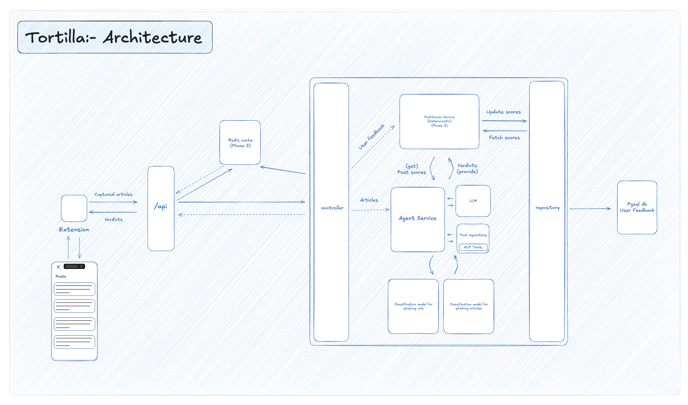

<p align="center">
  
</p>

# Tortilla — AI Guardian to combat misinformation


Tortilla is a robust guardian for combating misinformation that users end up consuming through web articles, posts on social media and viral media sources.

## Core idea

- The agent summarizes and chunks content (articles, posts) into verifiable units.
- Each chunk is processed by a filters pipeline (fact-check APIs, user-reported signals, ML scam/misinformation detectors).
- The agent collates filter outputs and produces a final verdict per chunk (and an aggregated verdict for the article/page).

## Why this matters

Users routinely consume content composed from many fast network calls (timeline APIs, CDNs, 3rd-party widgets). Deterministically capturing the response body and evaluating smaller units (chunks) enables focused, explainable verdicts and makes it feasible to combine many independent evidence sources.

## Repository mapping (where things live)

- Browser module / extension: `Extension/content-verifier-extension` (Posts payloads to API)
- API entrypoint: `main.py` (mounts routers and provides middleware for ingest diagnostics)
- Controllers: `controller/AnalysisController.py`, `controller/Healthz.py`, base helper in `controller/base.py`
- Parser: `service/ArticleParser.py` (extracts article text from timeline / timeline-like JSON)
- Agent skeleton: `service/AgentService.py` (placeholder for classification, hooking LLMs / tools)
- Plan + tool wiring: `utils/portiaFile.py` (Portia plans for claim extraction and fact-check flows)
- Sentence/Article exposed endpoints: `BE.py`
- DTOs: `DTO/Article.py` (Pydantic request model used by the ingest endpoint)
- Debug artifacts: `debug_ingests/` (saved payloads/results for offline inspection)

## Architecture Diagram



## Minimal runtime (dev)

1) Create and activate venv

```bash
python -m venv .venv
source .venv/bin/activate
```

2) Install dependencies:

```bash
pip install -r requirements.txt
# add: pip install fastapi uvicorn
```

3) Run the server (dev, uvicorn):

```bash
uvicorn main:app --reload
```

Alternative: run using the `uv` CLI

```bash
uv sync
```

```bash
# Run the main script (will execute the module's __main__ behavior)
uv run main.py

# Run a standalone utility (example: Portia plan runner file in this repo)
uv run utils/portiaFile.py
```

Note: `uv` is an optional runner and may come from packages or SDKs installed into your virtualenv; if it is not available you can continue to use `uvicorn` or `python` directly.

## Concrete architecture improvements & ideas (practical, implementation-focused)

1) Capture reliability and determinism
- Use a small injected script + devtools extension to hook `fetch`/`XMLHttpRequest` and persist the raw response body. Prefer deterministic interception points (GraphQL queries, timeline endpoints) and validate payload schema. Capture both request and response metadata (URL, headers, timing).

2) Chunking and claim extraction
- Use a combination of rule-based sentence splitting and an LLM-driven extractor to produce short, verifiable claims (<=1 sentence, 10–20 words).
- Keep chunk size small to reduce hallucination when fact-checking and to increase the chance an external fact-check matches.
- Produce provenance metadata for each chunk: source URL, byte offsets, surrounding paragraph, and confidence.

3) Filter pipeline (pluggable)
- Fact-check APIs (Google Fact Check Tools / ClaimReview aggregator, or scraped fact-check sources).
- User-reported signals (via extension UI or centralized repo; include thumbs-up/thumbs-down and reason tags).
- ML detectors: scam/spam classifiers, toxicity detectors, re-published-article detection (near-duplicate detection). Keep these as small, testable services (Docker containers or simple APIs).
- Rate-limit and cache filter results (many chunks will query the same claim text).

4) Collation & reasoning
- Normalize all filter outputs to a shared schema: {source, verdict: True|False|Unknown, confidence, evidence_url, note}.
- Use a small decision function (rules + weights) to combine votes into a final verdict. Example: if 2+ high-confidence fact-checks say False -> verdict False; otherwise combine model scores and user votes with confidence thresholds.
- Persist per-chunk audit trail for explainability.

5) Human-in-the-loop & feedback
- Provide UI for users to contest a verdict. Keep contested items in a review queue for human validators.
- Use validated corrections as training data for ML detectors and to tune decision weights.

6) Performance & scale
- Stream pipeline: accept capture -> return immediate lightweight verdict (fast-path) while continuing to enrich results asynchronously (deep-check). Provide incremental updates to the extension via websockets or background polling.
- Cache normalized chunks and verdicts by canonical claim fingerprint (normalized text hash) to avoid repeating external API calls.

7) Data governance & privacy
- Minimize storage of personal data. If storing raw payloads for debugging, encrypt at rest and limit retention.
- Consider local-only mode where the extension runs chunking + some lightweight filters in the browser without shipping content to a server.

8) Evaluation and metrics
- Keep a small labeled dataset for measuring precision/recall on common misinformation categories and calibrate model thresholds.
- Track: avg latency (fast path vs deep-check), cache hit rates, user feedback conversion (corrections accepted), and false positive rate reported by reviewers.